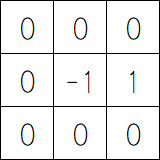
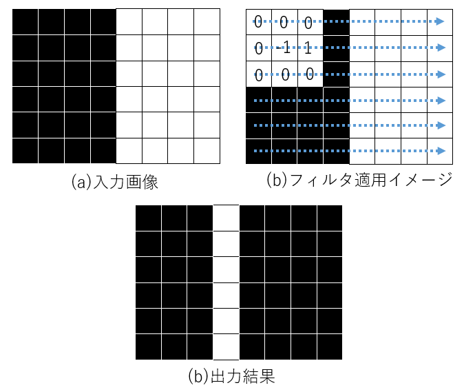
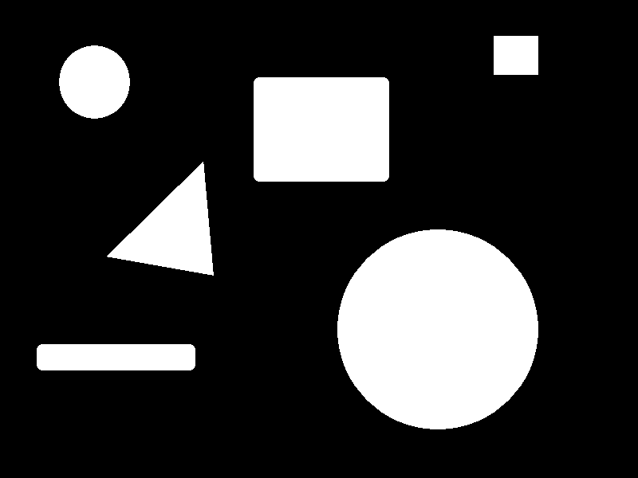
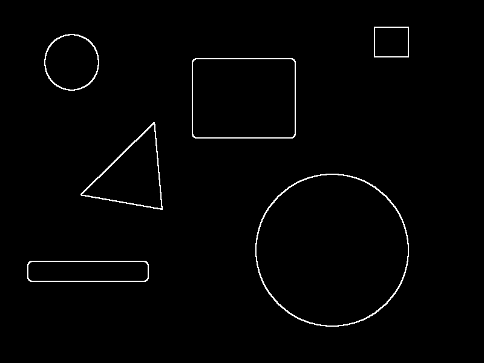
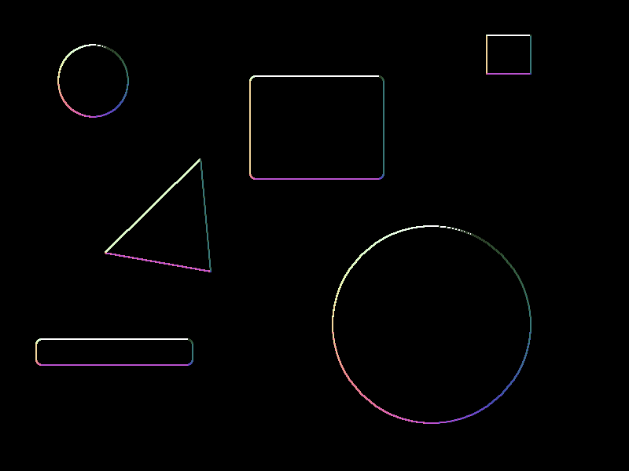

# B3プログラミングゼミ 第5回

今回実施する内容は以下の通りです．

* **エッジ抽出**

実装の際は以下のようなことを考えてみてください．(ひょっとしたら考察のネタになるかも...)

- エッジとはそもそも何か
- エッジ強度，エッジ角度はそれぞれどのようなパラメータか
- エッジを抽出するためのフィルタにはどのようなものがあげられるか
- エッジをよりキレイに抽出するためにはどのような前処理が必要か

## エッジ抽出

画像処理において，**エッジ**とは画素値が急激に変化している部分を示すものです．画素の変化は画像中の対象を分割する境界を示すため，画像の特徴解析手法の1つとしてよく用いられています．今回のゼミでは線形フィルタを利用したエッジ抽出を学習します．

エッジ抽出処理にはいくつかの手法がありますが，最も基本的なものは隣接画素間の差を出力する方法です．例として，図1のような注目画素とその右隣との差を出力するフィルタを用意し，図2 (a) のような画像に対して図2(b)のようなフィルタを走査(たたみ込み演算)を行います，このとき，出力結果は図2 (c) となります. 

  図1 横微分フィルタ

  

  図2 微分フィルタ適用例

入力画像 $ f(i, j) $, 出力画像を $ g(i, j) $ , としたとき，演算式は式(1)で表されます．ただし，フィルタの大きさ $ (2W+1) * (2W+1) $ , フィルタの係数を表す配列 $ h(m, n) $ です．

$g(i, j) = \sum_{n=-W}^{W} \sum_{m=-W}^{W} f_{i+m, j+n}*h(m, n) \ \ \ \ - (1)$

エッジ抽出では隣接画素との差分を求める処理であるため，**画像に対する微分**であると考えることができます．

微分フィルタとしてよく使用されるものには以下のような例があります．
- プリューウィットフィルタ
- ソーベルフィルタ
- ラプラシアンフィルタ

各フィルタの特徴やその処理結果は参考書『ディジタル画像処理[改訂第2版]』p.109 ~ p.116に記載されています．

### エッジ強度

エッジ強度とは，エッジ勾配の大きさを表します．画像中の注目物体とそうでない部分を分ける境界(輪郭)が，どれだけはっきりと表れているかを示す指標，と言い換えるとわかりやすいかもしれません．

エッジ強度は式(2)で表されます．

$S = \sqrt{dx^2 + dy^2} \ \ \ -(2)$ 

### エッジ角度

エッジ角度とは，エッジが示す勾配の方向を表す指標です．画像の明るさの変化の方向が最も大きい方向(エッジ上ではエッジに垂直な方向)を表しています．

エッジ角度は式(3)で表されます．

$\theta = tan^{-1} \frac{dy}{dx} \ \ \ -(3) $

入力画像に対し，エッジ強度，エッジ角度を出力した例が図3です．エッジ角度画像については，角度(0°≦ $ \theta $ ≦ 360°)について色相として扱い出力しています．

    

  図3 結果例(左：入力画像，中：エッジ強度画像，右：エッジ角度画像)

## 実装課題

1. 微分フィルタをかけて画像からエッジを抽出する処理を実装してください．
2. エッジ抽出で画像内のノイズを拾わないようにするためにはどのような前処理が適切であるか，記述してください．

処理結果画像，およびプログラムをレポートに貼り付けて提出してください．

処理を実装するファイルは以下の通りです．

- `edge.py`：入力画像からエッジ強度，エッジ角度の値を求める処理を行なうソースファイル
- `main.py`：`main`関数が記述されているソースファイル

自分で新しくファイルを作成する，処理を追加する等は問題ありません．想定された処理が実装できる範囲内で，より良い処理を目指してください!

### 実装のポイント

- フィルタには様々な種類があります．いろいろ試して各フィルタの特徴を掴んでみましょう．
- エッジ検出の結果はdouble型のデータで返されます．

